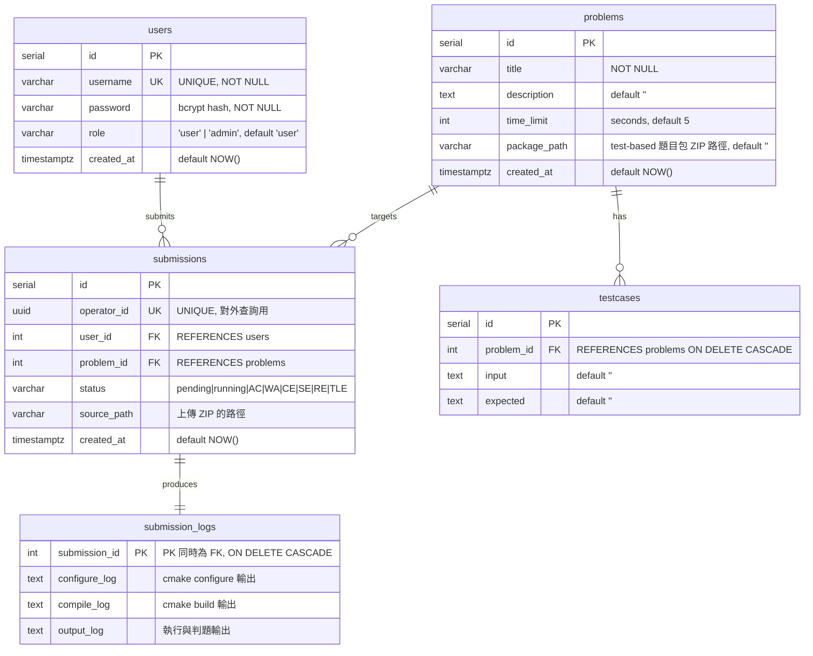
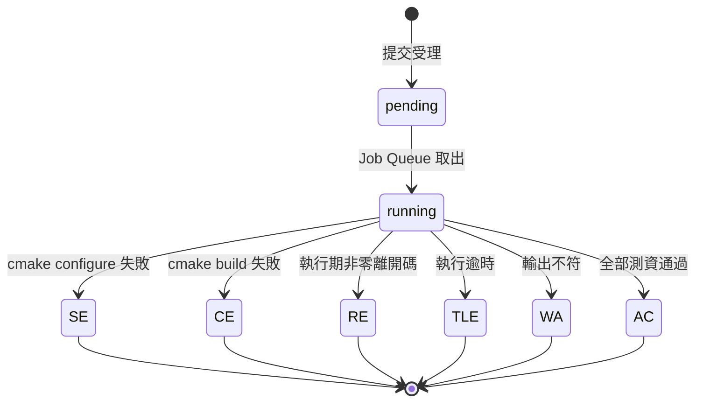

# REGS 資料庫 ERD

本系統使用 PostgreSQL 16，共五張資料表。DDL 定義於 [`internal/db/schema.sql`](../internal/db/schema.sql)。

該檔以 `go:embed` 內嵌至執行檔，伺服器**每次啟動時自動套用**（所有語句皆為
`IF NOT EXISTS` 形式，重複執行安全）。因此無論全新或既有資料庫，`docker compose up`
之後結構即為最新，不需另行執行 migration，本機也不需要安裝 psql。

## Entity-Relationship Diagram

## 關聯說明

| 關聯 | 型態 | 說明 |
|------|------|------|
| `users` → `submissions` | 1:N | 一位使用者可有多筆提交 |
| `problems` → `submissions` | 1:N | 一道題目可被多次提交 |
| `problems` → `testcases` | 1:N | 一道題目擁有多組測資；刪題時 `ON DELETE CASCADE` 連帶清除 |
| `submissions` → `submission_logs` | 1:1 | 每筆提交對應一列日誌（建立提交時一併插入空列）；`submission_id` 既是主鍵也是外鍵 |

## 設計重點

- **`operator_id` (UUID)**：對外 API 一律以此不可枚舉的 UUID 查詢提交，避免以連續整數 `id` 直接被遍歷。
- **`package_path` 決定判題模式**：欄位非空代表該題為 **test-based**（判題時解壓題目包、以 ctest 執行）；為空則為 **I/O 比對**模式（改用 `testcases` 表的 input/expected 逐測資比對）。API 回應中的 `judge_mode` 欄位即由此欄位即時推導，並非實體欄位。
- **三段日誌獨立成表**：`configure_log` / `compile_log` / `output_log` 分開儲存，對應判題三階段，供 API 分別查詢；另外也會落地為實體 `.log` 檔（見下方「檔案路徑欄位」）。
- **狀態機**：`status` 由 `pending → running` 起始，終態為 `AC / WA / CE / SE / RE / TLE` 其中之一。
- **軟性關聯完整性**：`testcases`、`submission_logs` 以 `ON DELETE CASCADE` 綁定父表，刪除題目或提交時自動清理子資料。
- **管理員帳號由程式建立**：`users` 表不含種子資料；伺服器啟動時以 `INSERT ... ON CONFLICT (username) DO NOTHING` 建立預設管理員（`admin`），故重啟不會覆寫既有帳號或密碼。

### 檔案路徑欄位

`problems.package_path` 與 `submissions.source_path` 存的是**檔案系統路徑**，而非檔案內容——實體檔案位於 `regs-storage` 資料卷，由 app 容器掛載於 `/app/storage`：

| 欄位 / 位置 | 路徑 |
|------------|------|
| `problems.package_path` | `/app/storage/problems/{problem_id}.zip` |
| `submissions.source_path` | `/app/storage/uploads/{operator_id}.zip` |
| 解壓後工作目錄 | `/app/storage/workspace/{operator_id}/`（`src/` 為提交檔、`problem/` 為題目包） |
| 三段實體日誌 | `/app/storage/logs/{operator_id}/{configure,compile,output}.log` |

> 這些是**容器內**的絕對路徑。資料庫只記路徑不記內容，因此若資料卷被清除（`docker compose down -v`）而資料庫保留，這些欄位會指向不存在的檔案，判題時將得到 `SE`（`failed to extract problem package`）。兩者請一併清除或一併保留。

### 索引

除主鍵與唯一鍵外，另針對查詢熱點建立索引：

| 索引 | 欄位 | 用途 |
|------|------|------|
| `users_username_key` | `users(username)` | 登入查詢、註冊唯一性檢查 |
| `submissions_operator_id_key` | `submissions(operator_id)` | 所有對外提交查詢的入口 |
| `idx_submissions_user_id` | `submissions(user_id)` | 個人提交列表、使用者統計 |
| `idx_submissions_problem_id` | `submissions(problem_id)` | 題目統計 |
| `idx_submissions_status` | `submissions(status)` | 依狀態篩選 |
| `idx_testcases_problem_id` | `testcases(problem_id)` | 判題時載入該題測資 |

## 狀態機

