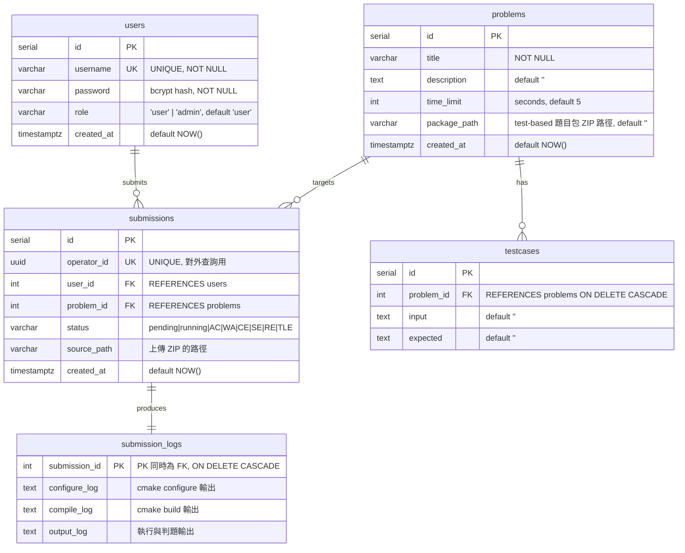
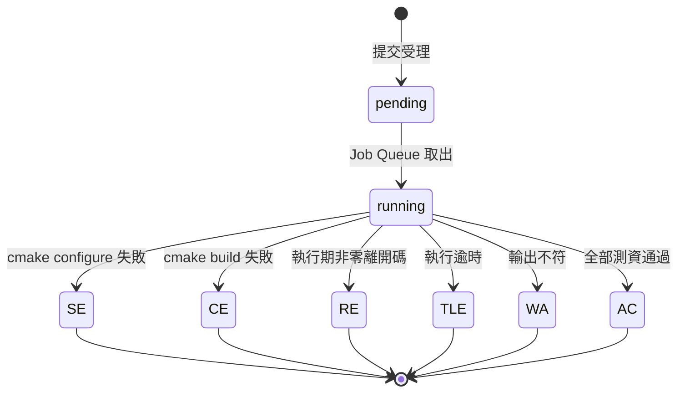

# REGS 資料庫 ERD

本系統使用 PostgreSQL 16，共五張資料表。DDL 定義於 [`internal/db/schema.sql`](../internal/db/schema.sql)。

## Entity-Relationship Diagram

## 關聯說明

| 關聯 | 型態 | 說明 |
|------|------|------|
| `users` → `submissions` | 1:N | 一位使用者可有多筆提交 |
| `problems` → `submissions` | 1:N | 一道題目可被多次提交 |
| `problems` → `testcases` | 1:N | 一道題目擁有多組測資；刪題時 `ON DELETE CASCADE` 連帶清除 |
| `submissions` → `submission_logs` | 1:1 | 每筆提交對應一列日誌（建立提交時一併插入空列）；`submission_id` 既是主鍵也是外鍵 |

## 設計重點

- **`operator_id` (UUID)**：對外 API 一律以此不可枚舉的 UUID 查詢提交，避免以連續整數 `id` 直接被遍歷。
- **`package_path` 決定判題模式**：欄位非空代表該題為 **test-based**（判題時解壓題目包、以 ctest 執行）；為空則為 **I/O 比對**模式（改用 `testcases` 表的 input/expected 逐測資比對）。API 回應中的 `judge_mode` 欄位即由此欄位即時推導，並非實體欄位。
- **三段日誌獨立成表**：`configure_log` / `compile_log` / `output_log` 分開儲存，對應判題三階段，供 API 分別查詢；另外也會落地為 `storage/logs/{operator_id}/` 下的實體 `.log` 檔。
- **狀態機**：`status` 由 `pending → running` 起始，終態為 `AC / WA / CE / SE / RE / TLE` 其中之一。
- **軟性關聯完整性**：`testcases`、`submission_logs` 以 `ON DELETE CASCADE` 綁定父表，刪除題目或提交時自動清理子資料。

## 狀態機

