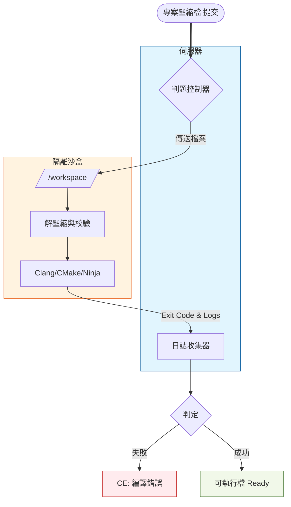

# CS3060701 期末專案 - REGS

## 概述

專案的核心目標是開發包含以下功能的後端系統：

- 跨平台方便使用
- 自動化處理
- 編譯處理
- 執行並輸出結果

同學們需要結合容器技術與現代化編譯工具鏈，解決環境隔離與自動化流程的挑戰。

## 專案目標




### 自動化編譯管道

> [參考資料：OOP專案配置教學](https://hackmd.io/@directory/Gamelab-CMake)
> 範例容器：`yhlib/cs3060701`
 
1.  任務受理與環境準備
    * **伺服器**接收壓縮檔，分配 `operatorId`。
    * 啟動容器並掛載暫存目錄。
2.  預處理
    * **伺服器**檢查專案根目錄是否存在 `CMakeLists.txt`。
3.  配置階段
    * 配置 CMake 專案，監控此步驟的 Exit Code。
    * **判定邏輯**：
        * 若失敗：狀態設為 **「初始化錯誤 SE (Setup Error)」**，代表使用者的 CMake 腳本有誤。
        * 擷取此階段的所有輸出並重導向至 `configure.log`。
4.  編譯階段
    * **執行指令**：`cmake --build build --verbose`
    * **判定邏輯**：
        * 若失敗：狀態設為 **「編譯錯誤 (Compilation Error, CE)」**，代表語法錯誤。
        * 擷取此階段的所有輸出並重導向至 `compile.log`。
5.  執行與判題
    * 當前兩個階段都成功時，執行結果
    * 進行超時控制 (TLE) 與結果比對 (AC/WA)。
    * 擷取此階段的所有輸出並重導向至 `output.log`。

> [!Tip] 實作建議
>
> 1. 關於「非同步處理」與狀態管理
>     - 實作「提交」功能時，伺服器不應該等代碼編譯完才回傳。
>     - 建議使用背景執行緒（Thread）或任務佇列（Task Queue）。伺服器收到檔案後，應先回傳一個 `operatorId`，然後在背景啟動 Docker 執行判題邏輯。
> 2. 關於判斷的控制
>     - 將主機的暫存目錄掛載到容器內的 **Volume**。
>     - Exit Code：`docker wait` 或檢查容器物件的 `State.ExitCode`
> 3. 關於 CMake 的兩階段執行
>     - 第一步執行 `cmake -G Ninja -B build`，如果這步失敗，回傳 **Setup Error**。
>     - 第二步執行 `cmake --build build`，如果這步失敗，回傳 **Compilation Error (CE)**。
>     - 日誌需要重導向，之後才能透過 API 讀取日誌。
> 4. 關於判題邏輯 (Judge Logic)
>     - 最簡單的方法是逐行比對 `user_output.txt` 與 `answer.txt`。
>     - 超時控制：不要只依賴程式內部的計時，在啟動 Docker 時設定一個 `timeout` 參數。如果容器運行超過 \<N> 秒還沒結束，直接中止容器，並將狀態標記為 **TLE**。

### 查詢功能

在 REGS 線上評測系統中，這三個 Role 定義了使用者在系統中的「權限邊界」與「行為模型」。

#### Guest (訪客)

- 未經身份驗證的匿名使用者。

#### User (一般使用者 / 參賽者)

- 已註冊並通過身份驗證的學習者，是系統的主要服務對象。

#### Admin (管理者 / 出題者)

- 維護系統內容與運作的特權使用者（如老師或助教）。

| 功能屬性              | Guest   | User          | Admin         |
| --------------------- | ------- | ------------- | ------------- |
| **瀏覽題目清單**      | O       | O             | O             |
| **提交代碼 (Submit)** | &times; | O             | O             |
| **查看他人代碼**      | &times; | &times;       | O             |
| **編輯題目/上傳測資** | &times; | &times;       | O             |
| **認證方式**          | 無  | JWT | JWT |

請規劃資料庫的權限設定，並設定 RBAC 的權限設定。

金鑰生成
```
openssl genpkey -algorithm EC -pkeyopt ec_paramgen_curve:P-256 -out private.pem
openssl pkey -in private.pem -pubout -out public.pem
```

## 配分

以下區塊說明本學期期末專案的評分基準

### 自動化編譯管道

| Metrics          | Description                                                   | Check Point                                   | Score |
| ---------------- | ------------------------------------------------------------- | --------------------------------------------- | :---: |
| ZIP 上傳與解壓縮 | 支援接收 .zip 格式的專案檔，並在掛載至容器前正確解壓縮。      | 檢查目錄結構是否完整（需含 CMakeLists.txt）。 |   3   |
| 容器網段隔離     | 編譯容器與執行容器需位於不同 Network，執行容器必須完全斷網。  | 執行階段使用 --network none 以防止網路攻擊。  |   2   |
| CMake 管線自動化 | 自動執行 Configure (cmake -G) 與 Build (cmake --build) 流程。 | 必須能自動抓取各階段的 Exit Code。            |   5   |
| 五種基本狀態判定 | 系統能根據執行結果準確回傳 AC、WA、CE、RE。                   | 比對輸出 (AC/WA)；Exit Code 非 0 (RE)。       |   5   |
| 多分段日誌查詢   | 提供 API 供外部（Module B）分別查詢配置、編譯與執行日誌。     | 儲存為 config.log、compile.log 等實體檔案。   |   5   |

以上合計 20 分，為本學期及格的最低標準

---

| Metrics        | Description                                             | Check Point                                 | Score |
| -------------- | ------------------------------------------------------- | ------------------------------------------- | :---: |
| 非同步任務隊列 | 接收提交後立即回傳 operatorId，評測過程在背景執行，且可以任意重新執行某個 Job。     | 實現 Job Queue                              |   5   |
| 併發控制機制   | 限制同時進行評測的容器數量，超額任務需排隊 (Pending)。  | 實作Semaphore控制最大併發數。              |   5   |

以上合計 10 分


### 權限控管與查詢功能

|    類別     |   方法   | URL                                  | 描述                               | 權限  |
| :---------: | :------: | ------------------------------------ | ---------------------------------- | ----- |
|  UserInfo   |  `POST`  | /api/users/register                  | 註冊新使用者帳號                   | Guest |
|  UserInfo   |  `POST`  | /api/users/login                     | 使用帳號密碼登入並簽署 JWT         | Guest |
|  UserInfo   |  `POST`  | /api/users/logout                    | 登出目前登入的使用者               | User  |
|  UserInfo   |  `GET`   | /api/users/me                        | 取得目前登入使用者的個人資料       | User  |
|  UserInfo   |  `GET`   | /api/users/{user_id}/submissions     | 取得指定使用者的提交紀錄           | Guest |
|   Problem   |  `GET`   | /api/problems                        | 取得題目列表                       | Guest |
|   Problem   |  `GET`   | /api/problems/{problem_id}           | 取得單一題目的完整描述             | Guest |
|   Problem   |  `PUT`   | /api/problems                        | 建立新題目，若題目已經存在，則更新 | Admin |
|   Problem   | `DELETE` | /api/problems/{problem_id}           | 刪除題目                           | Admin |
|  *Problem   |  `GET`   | /api/problems/{problem_id}/testcases | 下載題目壓縮檔                     | Admin |
| *Submission |  `POST`  | /api/submissions                     | 提交程式碼進行評測                 | User  |
| Submission  |  `GET`   | /api/submissions                     | 查詢個人提交紀錄列表               | User  |
| *Submission |  `GET`   | /api/submissions/{operatorId}        | 取得單一提交的評測結果             | User  |
| *Submission |  `GET`   | /api/submissions/{operatorId}/source | 取得提交的原始專案檔案             | User  |
| Statistics  |  `GET`   | /api/stats/problems/{problem_id}     | 取得題目統計資料                   | Guest |
| Statistics  |  `GET`   | /api/stats/users/{user_id}           | 取得使用者統計資料                 | Guest |

前面包含 `*` 的列表 `2` 分，其餘 API `1` 分

權限大小為 Admin > User > Guest。

- 若權限標注為 **Guest**，則 Admin、User、Guest 皆可存取
- 若權限標注為 **User**，則 Admin、User 皆可存取

但對於 **User** 與 **Admin** 的請求，都必須加上 `Authorization` Header

合計 20 分

### 文件

- OpenAPI 3.0 的 API 文件
- ERD 
- 專案操作說明

文件合計10分(不拆子項)

